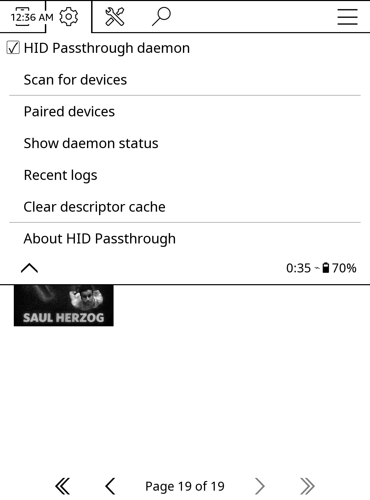

# Kindle HID Passthrough

A userspace Bluetooth HID host for Amazon Kindle e-readers. Connects Bluetooth HID devices (gamepads, keyboards, remotes) and passes input directly to Linux via UHID.

## Overview

This project implements a complete Bluetooth stack in userspace using [Google Bumble](https://github.com/google/bumble), bypassing the Kindle's buggy kernel Bluetooth drivers. HID reports are forwarded to the Linux input subsystem via `/dev/uhid`, making devices appear as native input devices.

```
BT HID Device  -->  /dev/stpbt  -->  Bumble (userspace BT stack)  -->  /dev/uhid  -->  Linux input (/dev/input/eventX)  -->  Keypresses
```

## Features

- **Generic HID support** - Works with any Bluetooth HID device (Classic or BLE)
- **Mixed protocol support** - Configure both BLE and Classic devices simultaneously
- **UHID passthrough** - Devices appear as native Linux input devices
- **UDEV keyboard device** - Devices can be treated as keyboard and keypresses used for text input.
- **Auto-reconnection** - Daemon mode with automatic reconnection
- **Hybrid connection** - Passive (device connects) + active (host connects) for Classic
- **SDP descriptor query** - Fetches real HID report descriptors from devices
- **Pairing support** - Interactive pairing with link key persistence
- **Support for international layouts** - Country-specific layouts (azerty, qwertz) and other layouts (dvorak, bepo) are supported.
- **BTManager** - On-device touchscreen UI for managing devices (no SSH needed)

As this project replaces the original Bluetooth stack, you can't use the default Bluetooth services (as listening to audiobooks) while service is active.

## Requirements

- Jailbroken Kindle
- Linux kernel with UHID support (`CONFIG_UHID`) - enabled by default on Kindle

## Installation

### KindleForge (recommended)

Install directly from [KindleForge](https://github.com/KindleTweaks/KindleForge) — search for "Kindle HID Passthrough" in the on-device app store.

### Manual install

1. Download the latest release from [GitHub Releases](https://github.com/zampierilucas/kindle-hid-passthrough/releases):
   ```bash
   wget https://github.com/zampierilucas/kindle-hid-passthrough/releases/latest/download/kindle-hid-passthrough-armv7.tar.gz
   tar -xzf kindle-hid-passthrough-armv7.tar.gz -C /mnt/us/kindle_hid_passthrough/
   ```

   The release contains a `dist/` directory with a bundled Python runtime and all dependencies — no Python installation required on the Kindle.

2. Run the interactive installer:
   ```bash
   cd /mnt/us/kindle_hid_passthrough
   sh scripts/install.sh
   ```

   This lets you pair devices, install udev rules, set up autostart, install the BTManager app, and set keyboard layouts.

### BTManager

A built-in Kindle app for managing Bluetooth HID devices from the touchscreen — no SSH needed. Scan for devices, pair, remove, start/stop the daemon, all from the Kindle UI.


Installed automatically via KindleForge. For manual installs, use option 6 in `scripts/install.sh`.

### KOReader plugin

If you use KOReader, a bundled plugin gives you the same scan / pair / connect / disconnect / logs / cache controls from inside KOReader — no need to exit. Open via **cog icon (Settings) → Network → HID Passthrough**.



Auto-installed via the interactive installer when `/mnt/us/koreader/plugins/` exists. See [`koreader-plugin/README.md`](koreader-plugin/README.md) for details.

## Usage

### Pairing a device

Via BTManager on the touchscreen, or via SSH:

```bash
/mnt/us/kindle_hid_passthrough/kindle-hid-passthrough --pair
```

### Running the daemon

```bash
# Via upstart (if installed)
start hid-passthrough
stop hid-passthrough

# Or run directly
/mnt/us/kindle_hid_passthrough/kindle-hid-passthrough --daemon

# View logs
tail -f /var/log/hid_passthrough.log
```

### Device configuration

Paired devices are stored in `devices.conf`:

```bash
# Format: ADDRESS PROTOCOL [NAME]
98:B9:EA:01:67:68/P classic Xbox Wireless Controller
5C:2B:3E:50:4F:04/P ble BLE-M3
```

**Mixed Protocol Support**: You can configure both BLE and Classic devices. The daemon automatically detects mixed protocols and uses a unified host that handles both simultaneously - the first device to connect wins.

### Changing keyboard layout

```bash
/mnt/us/kindle_hid_passthrough/scripts/setlayout.sh <layout>
```

Where `<layout>` can be the country code (`fr`, `de`, `cz` etc.) or country+variant (`'fr(oss)'`, `'fr(bepo)'`).

Available layouts: `ls /usr/share/X11/xkb/symbols`

## Mapping Inputs to Specific Actions

On **Kindle**, the reading application ignores standard input devices, so you need a separate input mapper to trigger actions like page turns. Recommended: [kindle-button-mapper-rs](https://github.com/zampierilucas/kindle-button-mapper-rs) - A lightweight daemon that maps HID inputs to Kindle actions.

On more **open devices like Kobo**, applications may read directly from `/dev/input/eventX`, so the HID devices created by this project could work out of the box without additional mapping.

## How It Works

### Why Userspace?

The Kindle's kernel Bluetooth stack has bugs that prevent proper HID pairing. By implementing the entire Bluetooth stack in userspace with Bumble, we bypass these limitations entirely.

### Architecture

1. **Transport**: Bumble communicates with the Bluetooth hardware via `/dev/stpbt`
2. **Protocol**: Supports both Classic Bluetooth (BR/EDR) and BLE HID profiles
3. **Pairing**: Handles SSP (Secure Simple Pairing) with link key persistence
4. **HID Reports**: Received via L2CAP (Classic) or GATT notifications (BLE)
5. **UHID**: Reports are forwarded to `/dev/uhid`, creating virtual input devices
6. **Linux Input**: The kernel parses the HID descriptor and creates `/dev/input/eventX`
7. **Udev**: Defines the input device as a keyboard and translates keypresses to keyboard input.

### Supported Protocols

| Protocol | Status | Notes |
|----------|--------|-------|
| Classic Bluetooth (BR/EDR) | Working | Gamepads, keyboards |
| BLE (Bluetooth Low Energy) | Working | Page turners, remotes |

## Hardware

Tested on:
- **Device**: Kindle MT8110 Bellatrix
- **SoC**: MediaTek MT8512 (ARMv7-A Cortex-A53)
- **Kernel**: Linux 4.9.77-lab126
- **Bluetooth**: MediaTek CONSYS via `/dev/stpbt`

## Troubleshooting

See [docs/troubleshooting.md](docs/troubleshooting.md) for manual commands, installation steps, and common issues.

## Development

See [CLAUDE.md](CLAUDE.md) for development setup and commands.

## References

- [Google Bumble](https://github.com/google/bumble)
- [Linux UHID Documentation](https://www.kernel.org/doc/html/latest/hid/uhid.html)
- [Bluetooth HID Profile Specification](https://www.bluetooth.com/specifications/specs/human-interface-device-profile-1-1-1/)
- [BLE HID Service Specification](https://www.bluetooth.com/specifications/specs/hid-service-1-0/)

## This software is distributed under the MIT License

Permission is hereby granted, free of charge, to any person obtaining a copy of this software and associated documentation files (the "Software"), to deal in the Software without restriction, including without limitation the rights to use, copy, modify, merge, publish, distribute, sublicense, and/or sell copies of the Software, and to permit persons to whom the Software is furnished to do so, subject to the following conditions:

The above copyright notice and this permission notice shall be included in all copies or substantial portions of the Software.

THE SOFTWARE IS PROVIDED "AS IS", WITHOUT WARRANTY OF ANY KIND, EXPRESS OR IMPLIED, INCLUDING BUT NOT LIMITED TO THE WARRANTIES OF MERCHANTABILITY, FITNESS FOR A PARTICULAR PURPOSE AND NONINFRINGEMENT. IN NO EVENT SHALL THE AUTHORS OR COPYRIGHT HOLDERS BE LIABLE FOR ANY CLAIM, DAMAGES OR OTHER LIABILITY, WHETHER IN AN ACTION OF CONTRACT, TORT OR OTHERWISE, ARISING FROM, OUT OF OR IN CONNECTION WITH THE SOFTWARE OR THE USE OR OTHER DEALINGS IN THE SOFTWARE.
